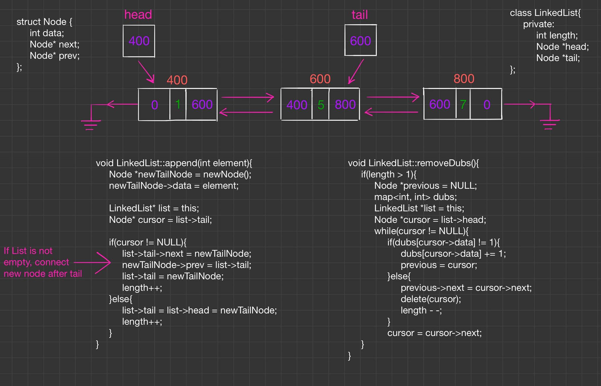
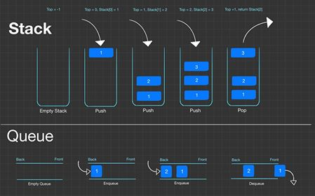
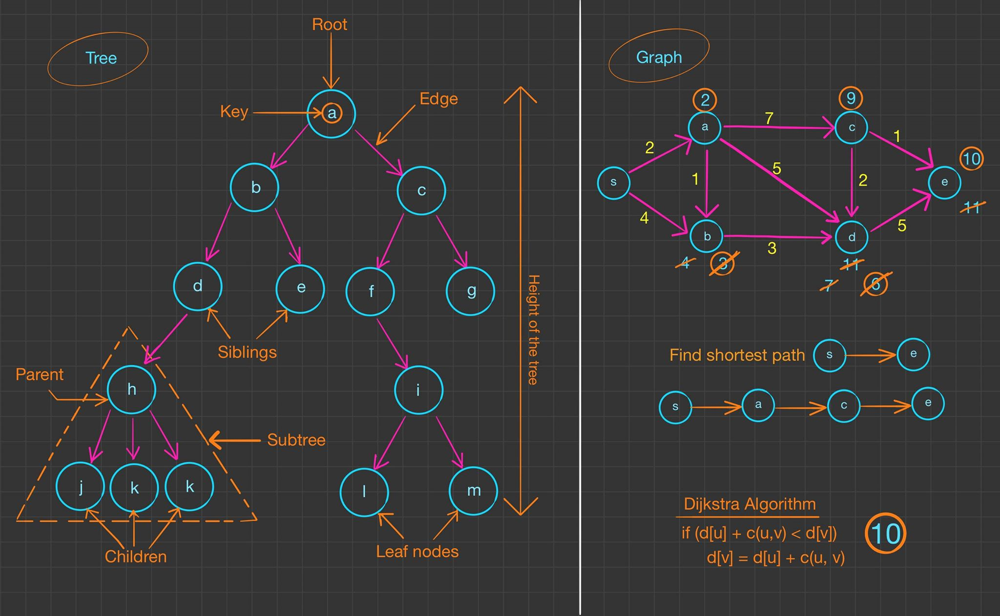
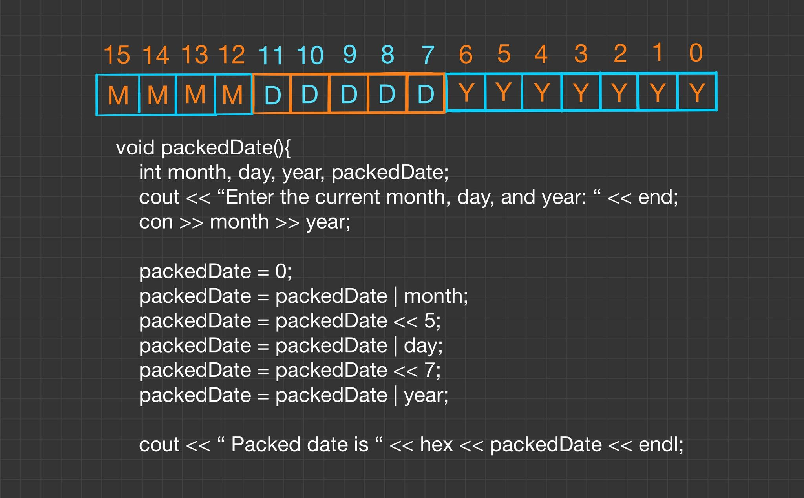

# Leetcode (C++)
# TripleByte (Generalist)
# Cracking The Coding Interview (C++)
# AlgoExpert and System Expert (C++ and Javascript)

This repository includes all the solutions coded and drawn out (whiteboard interview) 

# Contents: 
|                        |                                          |
| ---------------------- | ---------------------------------------- |
| 1. [Array and Strings](#Array-and-Strings)             |  2. [Linked List](#Linked-List) |
| 3. [Stack and Queues](#Stack-and-Queues)               |  4. [Trees and Graph](#Trees-and-Graph)|
| 5. [Bit Manipulation](#Bit-Manipulation)               |  6. [Math and Logic Puzzles](#Math-and-Logic-Puzzles) |
| 7. [Object-Oriented Design](#Object-Oriented-Design)   |  8. [Recursion and Dynamic Programming](#Recursion-and-Dynamic-Programming) |
| 9. [System Design and Scalability](#System-Design-and-Scalability)     |  10. [Soting and Searching](#Soting-and-Searching) |
| 11. [Testing](#Testing)                                |  12. [C and C++](#Cpp) |
| 13. [Databases](#Databases)                            |  14. [Threads and Locks](#Threads-and-Locks)  |
| 15. [Advance Topics](#Advance-Topics)                  |  16. [Triplebyte](#Triplebyte)    |  
| 17. [LeetCode](#LeetCode)                              |  18. [AlgoExpert & System Expert](#AlgoExpert) |

# Sections: 
### Array and Strings 
([Return back to Contents](#Contents))

### Linked List 
### ([Return back to Contents](#Contents))

### Stack and Queues
### ([Return back to Contents](#Contents))

### Trees and Graph
### ([Return back to Contents](#Contents))

### Bit Manipulation 
### ([Return back to Contents](#Contents))

### Math and Logic Puzzles
### ([Return back to Contents](#Contents))

### Object-Oriented Design 
### ([Return back to Contents](#Contents))

### Recursion and Dynamic Programming 
### ([Return back to Contents](#Contents))

### System Design and Scalability
### ([Return back to Contents](#Contents))

### Soting and Searching
### ([Return back to Contents](#Contents))

### Testing
### ([Return back to Contents](#Contents))

### C and C++
### ([Return back to Contents](#Contents))

### Databases
### ([Return back to Contents](#Contents))

### Threads and Locks
### ([Return back to Contents](#Contents))

### Advance Topics
### ([Return back to Contents](#Contents))

### Triplebyte
### ([Return back to Contents](#Contents))

### LeetCode
### ([Return back to Contents](#Contents))

### AlgoExpert & System Expert
### ([Return back to Contents](#Contents))
